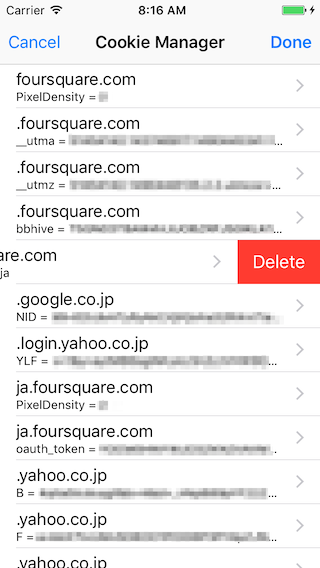

# CookieManager

Manage cookies of UIWebView.



## Features

* Show all cookies
* Delete specific cookie

## Installation

First, add the following line to your [Podfile](http://guides.cocoapods.org/using/using-cocoapods.html):

```
pod 'CookieManager'
```

Second, install `CookieManager` into your project:

```
pod install
```

## Usage

### Import

```swift
import CookieManager
```

## Requirements

Swift 3.0 / iOS 8.0+

## Creator

[Kosuke Ogawa](http://www.twitter.com/koogawa)

## License

The MIT License. See License.txt for details.
